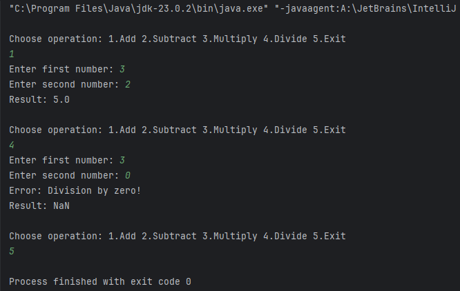

# 🧮 Java Console Calculator

A simple yet efficient **console-based calculator** application built using **Java**. This project showcases fundamental programming concepts like **methods**, **loops**, **conditionals**, and **exception handling**. Users can perform **Addition**, **Subtraction**, **Multiplication**, and **Division** through an intuitive console interface.

---

## ✨ Features
- ➕ Perform Addition
- ➖ Perform Subtraction
- ✖️ Perform Multiplication
- ➗ Perform Division (with safe divide-by-zero handling)
- 🔄 Continuous Calculations in a Loop until Exit
- 🖥️ Simple & Clean Console Interaction using `Scanner`
- ⚡ Optimized for O(1) time complexity per operation

---

## 🗂️ Project Structure
```
Java-Console-Calculator/
├── README.md
├── .gitignore
└── src/
└── Calculator.java
```

---

## 🚀 How to Run
1. **Clone the Repository**
    ```bash
    git clone https://github.com/IsaShaikh/Java-Console-Calculator.git
    cd Java-Console-Calculator
    ```

2. **Compile the Source Code**
    ```bash
    javac src/Calculator.java
    ```

3. **Run the Calculator**
    ```bash
    java -cp src Calculator
    ```

---

## 🧑‍💻 Code Overview
- **Modular Methods** for each operation: `add()`, `subtract()`, `multiply()`, `divide()`.
- Uses a **while loop** for continuous user interaction.
- **Switch-Case Control Flow** for operation selection.
- Handles **Divide-by-Zero** with clear error messaging.
- Written for **best practice readability & minimal time complexity**.

---

## 📋 Sample Console Interaction

